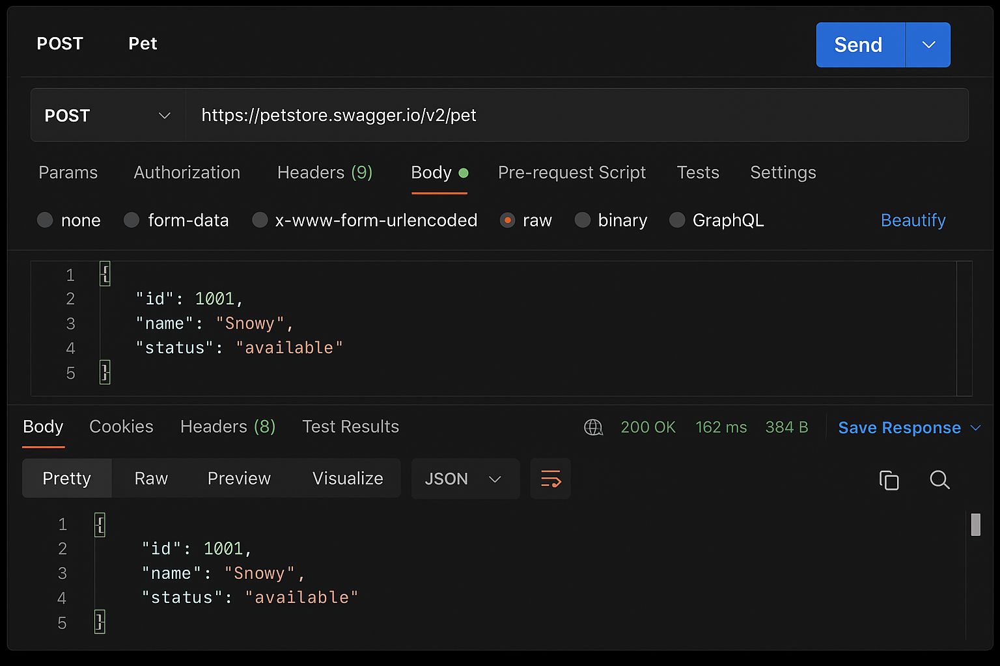
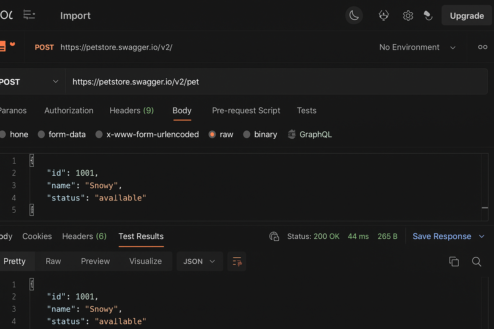

Petstore API – Swagger & Postman Testing Project

This project contains manual and automated API testing for the official Petstore API using Swagger UI and Postman.

## 🔹 API Under Test
https://petstore.swagger.io

## 🔹 Tools Used
- Postman
- Swagger UI
- Excel (Test Cases)
- Word (Bug Reports)

## 🔹 Project Structure
- Postman Collection
- Test Cases (Excel)
- Bug Reports (Word)
- Test Results (images)

## 🔹 Covered Test Scenarios
✔ Create a pet  
✔ Update a pet  
✔ Get pet by ID  
✔ Delete pet  
✔ Negative testing (invalid ID, missing body)
## 📸 API Test Screenshots

### 🟦 1) Result 1 – POST (Negative or initial test)

---

### 🟩 2) Result 2 – POST Valid Body (200 OK)

---

### 🟧 3) Result 3 – Test Results Assertions

